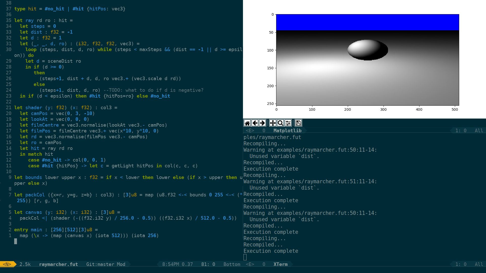

# Liveshader

Automatically run Futhark code to generate and display an image. Every time the Futhark file is saved, it will be recompiled, run, and displayed as image output.

This is similar to (Shadertoy)[https://www.shadertoy.com/], but using Futhark and OpenCL instead of GLSL and WebGL.

## Usage

Write a shader file in Futhark, containing an entry-point `main : [y][x][3]u8`, which outputs a 3D array of y-pixels * x-pixels * rgb colour.


```Futhark
entry main : [256][512][3]u8 =
  map (\y ->
         (map (\x ->
                 [u8.i32 (x / 2), u8.i32 y, 0])
              (iota 512)))
      (iota 256)
```

```sh
python3 liveshader.py input.fut
```

This will output compiler output to the terminal, and open a window displaying the image. Whenever the source file is changed, it will recompile and redisplay the image.



## Dependencies

- Futhark
- OpenCL
- python3
  - pyopencl
  - pyinotify
  - numpy
  - matplotlib
